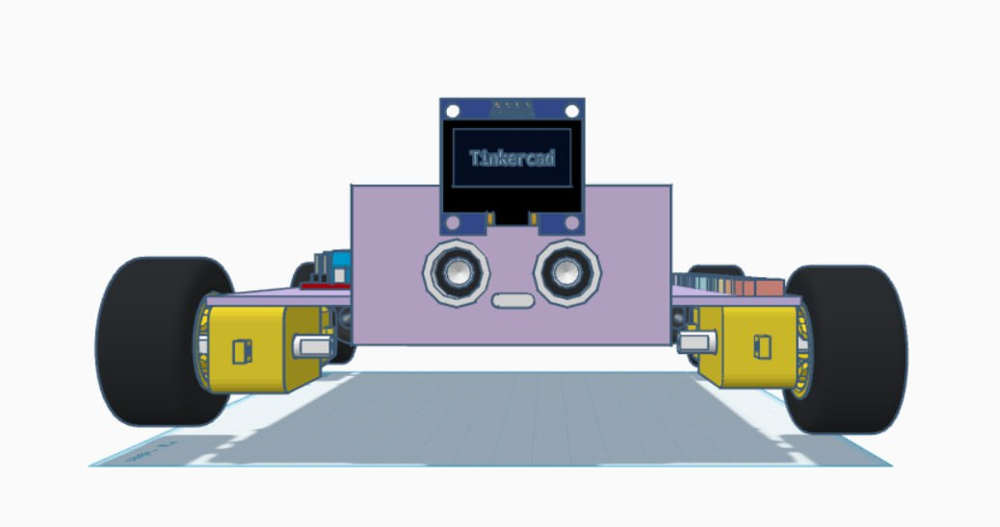
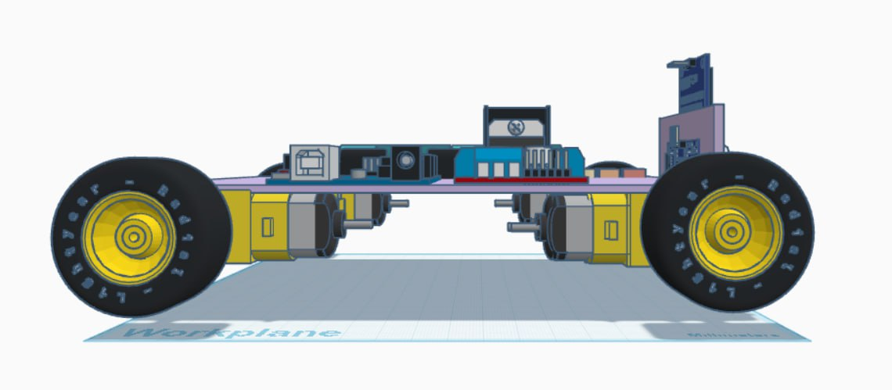

# 📐 3D Model of the Mobile Platform (TinkerCAD)

## 1. Overview and Purpose

The complete three-dimensional model of the robot's structure was designed in the online environment **TinkerCAD**. The model includes the chassis, as well as all necessary mounts and spaces for placing electronic components (Arduino, L298N driver, OLED display, HC-SR04).

**Goal:** To ensure the possibility of accurate reproduction of the mechanical part of the project.

## 2. Key Structural Elements

The model accounts for and fixes the following elements:

* **Chassis:** The main platform for mounting all components.
* **Mounts for Arduino UNO and L298N:** Ensure secure fixation of the control electronics.
* **HC-SR04 Holder:** Positioned at the front for accurate distance measurement.
* **OLED Display Mount:** Ensures visibility of the display for visual debugging and monitoring.
* **Motor Holes:** Account for the size of the motors and axles.

## 3. Files and Access

For easy viewing of the model and its structure, a direct link to the project in TinkerCAD is provided.

* **TinkerCAD Online Project:** [https://www.tinkercad.com/things/1LhHMPe5pUA-fiiin?sharecode=-o8NtV5vDrTe1A9Cbz-LPhXvqe7OT9cr3gdRrG44W_s](https://www.tinkercad.com/things/1LhHMPe5pUA-fiiin?sharecode=-o8NtV5vDrTe1A9Cbz-LPhXvqe7OT9cr3gdRrG44W_s)

## 4. Visualization

Below is a screenshot or render of the model, demonstrating the placement of all components on the platform: