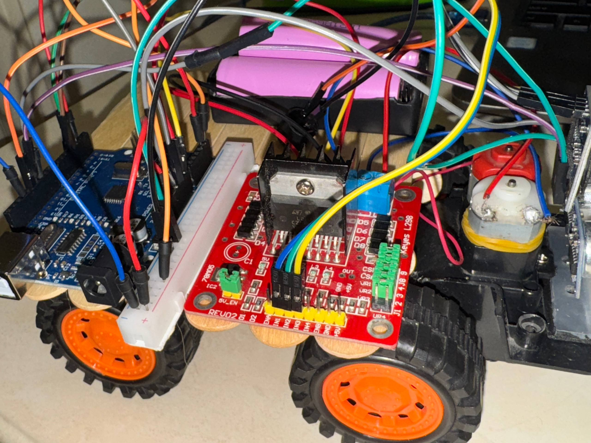
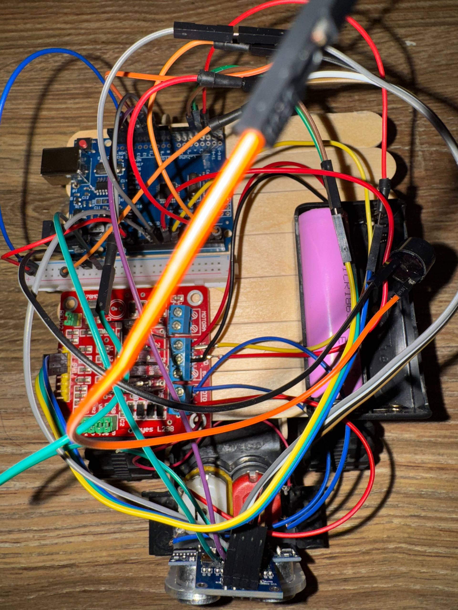
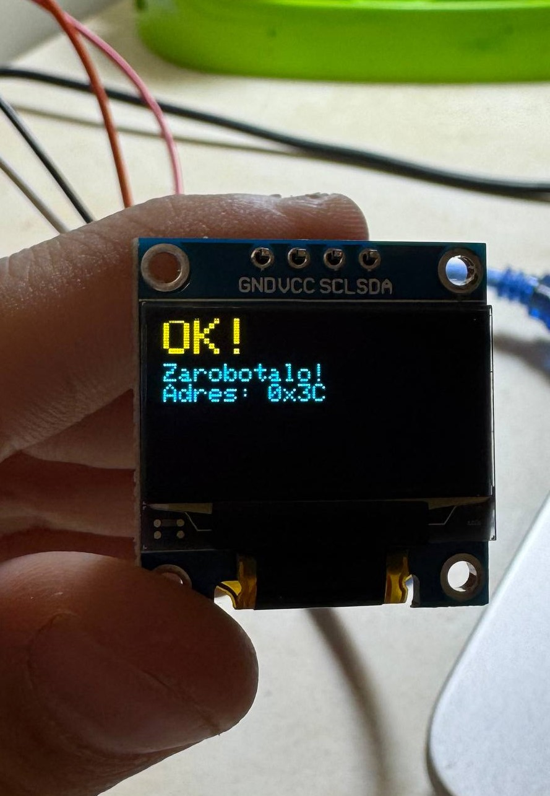
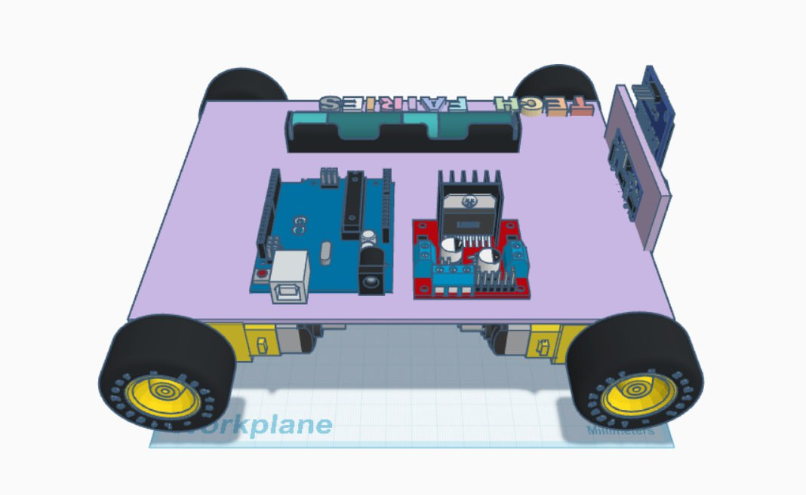

## TECHNICAL DOCUMENTATION: Autonomous Smart Car (Collision Avoidance)

### 1. Overview

This document provides a **comprehensive technical description** of the **Autonomous Smart Car** mobile platform. The project demonstrates basic autonomy (Phase 1): reliable obstacle detection and avoidance at a critical distance using the HC-SR04 ultrasonic sensor and the L298N motor driver.

* **Core Objective:** To implement the "Move $\leftrightarrow$ Stop" logic when an obstacle is detected at a distance $\le 15\text{ cm}$.
* **Key Feature:** The project utilizes a **direct L298N connection**, which necessitates a deep understanding of PWM principles and low-level motor control.

### 2. Hardware Components

#### 2.1 Electronic Components

| Component | Role in the Project | Notes |
| :--- | :--- | :--- |
| **Microcontroller** | Arduino UNO | Central processing unit |
| **Motor Driver** | L298N H-Bridge Driver | Controls power and direction for two DC motors |
| **Distance Sensor** | HC-SR04 Ultrasonic Sensor | Obstacle detection |
| **Display** | OLED Display (128x64, I2C) | Visualizes status and distance data |
| **Motors** | $2 \times$ DC geared motors | Actuation mechanism (requires external power) |
| **Power Supply** | External Power Supply (7-12V) | For L298N and motors |

#### 2.3 Physical Layout (Views)

To facilitate replication and understanding of the assembled platform, the physical layout of the components is shown below.

##### Component Layout and WiringTop View with Electrical Connections

Shows the layout of the main microcontroller, motor shield, and the ultrasonic sensor mounted on the servo motor.

##### Top View

This view demonstrates the arrangement of the main electronics, including the Arduino Uno, the L298N driver, and the placement of the HC-SR04 and OLED display.

##### Bottom View

This view shows the positioning of the DC motors, wheels, and any required internal wiring or bracing.

#### 2.4 OLED Display Visualization

The OLED display provides critical real-time feedback to the user regarding the robot's operational status and distance readings.

| Operational Status | Display Content (Code: `showEmotion`) | Key Information | Image Example |
| :--- | :--- | :--- | :--- |
| **Moving Forward** | Large: `^_^` Small: `FWD! Dist: [XX] cm` | Confirms movement, shows current distance. |  |
| **Stopped (Alarm)** | Large: `:(` Small: `STOP! Obstacle. [XX] cm` | Confirms stop state, shows distance to obstacle. |  |

### 3. Wiring Diagrams and Electrical Connections

Strict adherence to the following pinout is essential for successful project replication.

#### 3.1 L298N Motor Driver Connection (Motor B)

The code uses pins for controlling one motor (Motor B). If two motors are used, the second set of pins (IN1, IN2, ENA) must also be connected and configured.

| **L298N Pin** | **Arduino Pin** | **Code Variable** | **Function** |
| :--- | :--- | :--- | :--- |
| IN3 | Digital Pin **4** | `IN3` | Direction |
| IN4 | Digital Pin **3** | `IN4` | Direction |
| ENB (Enable B) | Digital Pin **2** (PWM) | `ENB` | Speed (Set to **80**) |
| GND | GND | - | Common Ground |
| VCC | External Source (7-12V) | - | Motor Power |

#### 3.2 HC-SR04 Ultrasonic Sensor Connection

| **HC-SR04 Pin** | **Arduino Pin** | **Code Variable** | **Function** |
| :--- | :--- | :--- | :--- |
| Trig Pin | Digital Pin **10** | `trigPin` | Pulse Transmission |
| Echo Pin | Digital Pin **11** | `echoPin` | Pulse Reception |
| VCC / GND | **5V / GND** | - | Power |

#### 3.3 OLED Display Connection (I2C)

| **OLED Pin** | **Arduino Pin** | **Function** |
| :--- | :--- | :--- |
| SCL (Clock) | Analog Pin **A5** | I2C Clock |
| SDA (Data) | Analog Pin **A4** | I2C Data |
| VCC / GND | **5V / GND** | Power |

#### 2.5 3D Models 

While a pre-built chassis was used, custom components were designed using **Tinkercad** to ensure precise mounting and integration of the sensors and display.

| Component | Purpose | Location in Repository |
| :--- | :--- | :--- |
| **HC-SR04 Mount** | Securely holds the ultrasonic sensor at the front of the platform for stable readings. | `3d_models/HC_SR04_Mount.stl` |
| **OLED Frame/Holder** | Provides a clean, aesthetic housing and ensures display visibility on the chassis. | `3d_models/OLED_Frame.stl` |

### 4. Software and Libraries

The following libraries are required for compilation and correct operation:

1.  **Wire.h** (Standard Arduino library)
2.  **Adafruit SSD1306**
3.  **Adafruit GFX Library**

### 5. Code Structure and Logic

The code implements the autonomous movement logic with a stopping threshold of **$15\text{ cm}$** (`stopDistance`). The movement speed is set to **$80$** out of $255$ (`LOW_SPEED`).

#### 5.1 Core Logic (Function `loop()`)

| Condition | Distance | Motor Action | Visual Feedback |
| :--- | :--- | :--- | :--- |
| **Move Forward** | $> 15\text{ cm}$ (or 0) | `moveCar("forward")` | `showEmotion("happy", dist)`: Smiley `^_^` |
| **Stop (Alarm)** | $\le 15\text{ cm}$ | `moveCar("stop")` | `showEmotion("scared", dist)`: Smiley `:( ` and `STOP! Obstacle.` |

#### 5.2 Motor Control (Function `moveCar()`)

The `moveCar` function controls the direction and speed of Motor B:

| Command | IN3 | IN4 | ENB (Speed) |
| :--- | :--- | :--- | :--- |
| `"forward"` | HIGH | LOW | `LOW_SPEED` (80) |
| `"stop"` | LOW | LOW | 0 |
| `"backward"` | LOW | HIGH | `LOW_SPEED` (80) |

### 6. Power Requirements

* It is crucial to use an **external power source** (7-12V battery) for the VCC/GND pins of the L298N driver, as the motors draw current that the Arduino UNO cannot provide via USB.
* All grounds (GND) must be connected together.

### 7. Future Improvements

Considering further project development, the following improvements are recommended:

1.  **Full Autonomy (Phase 2):** Implement "Back-up and Turn" logic within the stopping block to ensure continuous movement and obstacle navigation, rather than a simple stop.
2.  **Smooth Movement:** Implement a **PID controller** for calibration and balancing the speed between the two motors, preventing unintentional drifting.
3.  **Enhanced QC:** Introduce a mandatory testing phase for all electronic components before assembly to minimize development downtime caused by faulty parts.