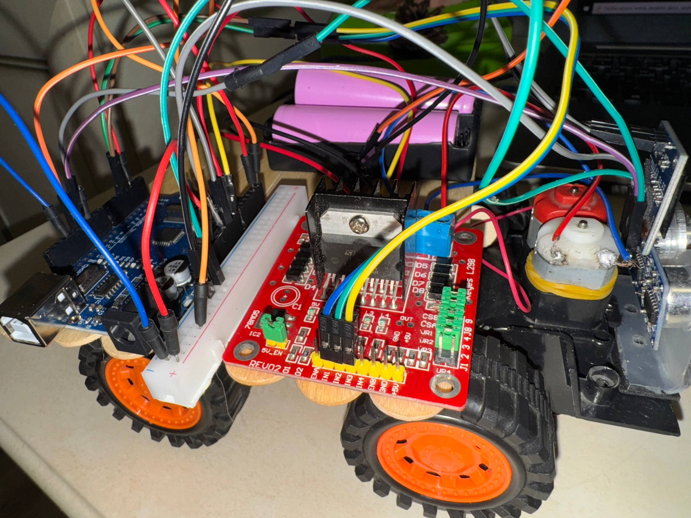

# Autonomous Smart Car

## 1. Project Overview

This repository contains an **Autonomous Smart Car** mobile platform built on Arduino UNO, designed to demonstrate robust **Collision Avoidance** logic using the HC-SR04 ultrasonic sensor.

This project serves as a **complementary implementation** to our main work: [Arduino_Auto-Car](https://github.com/Amina-sjs/Arduino_Auto-Car).

**Primary Goal:** To explore and validate an alternative hardware stack, utilizing the **L298N motor driver** and the **HC-SR04 ultrasonic sensor**, to create a system that ensures immediate stopping and audible signaling upon detecting an obstacle at a critical distance ($\le 15\text{ cm}$).

## 2. Hardware Stack

The robot is built using the following core components:

| Component | Function |
| :--- | :--- |
| **Microcontroller** | Arduino UNO | Central processing unit |
| **Motor Driver** | L298N H-Bridge Driver | Controls 2 DC motors (requires external power) |
| **Distance Sensor** | HC-SR04 Ultrasonic Sensor | Measures distance for obstacle detection |
| **Display** | OLED Display (128x64, I2C) | Visualizes status and distance data |
| **Alarm** | Buzzer | Provides audible alert upon collision threat |

## 3. Key Features and Core Logic

### Collision Avoidance

The system implements the "Move $\leftrightarrow$ Stop" logic based on real-time distance readings:

* **Move Forward:** The robot maintains forward motion while the distance is $> 15\text{ cm}$.
* **Stop & Alarm:** If an obstacle is detected at a distance $\le 15\text{ cm}$, the robot immediately **stops the motors** and **activates the Buzzer** for an audible warning.
* **Visual Feedback:** The OLED display provides continuous status updates (`FWD!`, `STOP! Obstacle.`).

## 4. Assembly and Visualization

### 4.1 3D Model

The structure, including custom mounts for sensors and the display, was designed using **TinkerCAD**. Model files for 3D printing are available in the folder [`/3d_models`](../model).

* **TinkerCAD Model Link:** [INSERT YOUR TINKERCAD MODEL LINK OR IMAGE HERE]

### 4.2 Wiring Diagram

The complete wiring scheme for all electronic components is provided below. **Note:** The L298N requires a **separate external power supply** (7-12V) for the motors.

* *For full pinout details and connection tables, refer to the [Documentation.md] file.*

### 4.3 Video Demonstration

A demonstration of the robot operating in the autonomous collision avoidance mode:

* **YouTube Link:** [https://youtube.com/shorts/squ-W640RpE?si=pAnp1GUBc01ee6Xv]

## 5. Challenges Encountered

During the project implementation, we faced the following main challenges:

* **L298N Power:** Ensuring a stable external power supply for the L298N driver, as the motors draw current exceeding the Arduino's capacity. Incorrect ground connection led to system failures.
* **HC-SR04 Calibration:** Setting the correct threshold value ($\le 15\text{ cm}$) for the HC-SR04 while mitigating noise and unstable readings.
* **OLED Integration:** Managing the simultaneous operation of the OLED display via I2C and other components on the digital pins.

## 6. Setup and Installation

Required libraries for successful compilation and operation: **Wire.h**, **Adafruit SSD1306**, and **Adafruit GFX Library**.

## 7. Team Contribution

The project was executed with the following distribution of roles and responsibilities:

| Team Member | Role and Responsibilities |
| :--- | :--- |
| **Mamadzanova Amina** | Created **all project documentation** (README and Technical Documentation), final debugging, and system testing. |
| **Mitalipova Saiida** | Implemented the main wiring, created the circuit diagram for the car. |
| **Mekishova Seyil** | Code writing, 3D model creation, and connection of the OLED display and the buzzer. |